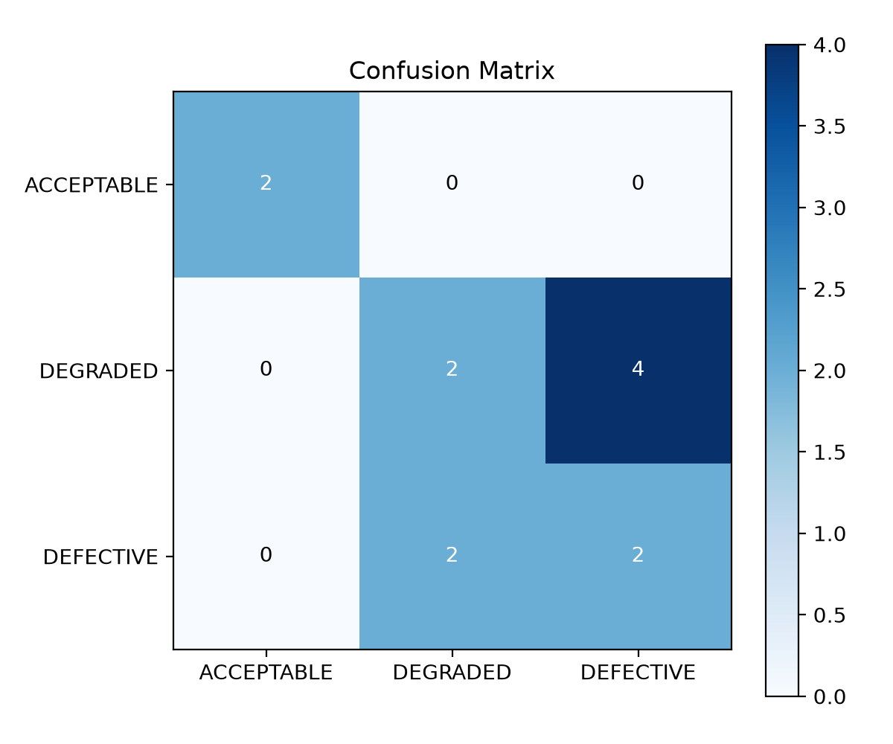

# ClarityAI Evaluation Report

## Dataset summary
- Test images: 12
- Accuracy: 0.5000
- Macro F1: 0.6000
- ROC-AUC (defective vs non-defective): 0.7500

## Confusion matrix

## Per-class metrics
- ACCEPTABLE: precision=1.000, recall=1.000, f1=1.000, support=2.0
- DEGRADED: precision=0.500, recall=0.333, f1=0.400, support=6.0
- DEFECTIVE: precision=0.333, recall=0.500, f1=0.400, support=4.0

## Conclusion
The baseline classifier and anomaly detector were evaluated on the held-out test set using the dataset generated by the project pipeline.